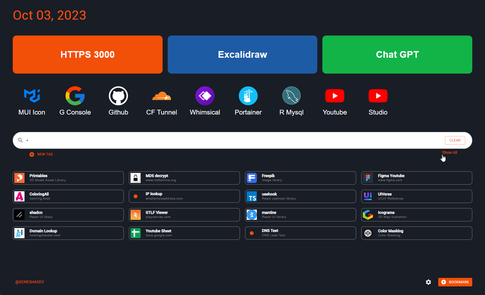

# **Sampis Dashboard**

# Best bookmark management ever ! (?)

this aplication still under continues developtment which will add more and more feature coming up soon. (might contain bugs, in short 0_o ) 
but yes, this is fully functional already. :)  
installation ? you no need to install anything.  
use it directly at [dashboard.genesha.dev](https://dashboard.genesha.dev)

leettss gooo... !!!

# Feature

1. **Your bookmark, your data, yours.**  
   the aplication not handle/save/use any of your bookmark aplication.  
   the data stored localy on your browser

2. **primary, secondary, tertier borkmark area**  
   3 group of bookmark area which can utilize and fullfill your need

3. **unique visibility and access**  
   you can set the default visibility of bookmark as visible or hidden. which can easly find or switched thru search or quick tag.

4. **auto icon** 
   auto detect the icon based on url path

5. **more at [youtube.com](https://youtube.com)** 
   trust me, iam not typical writing guy.

# Installation

if you insist to install your self, you can self deploy this aplication thru :

1. Self Host

- clone this repo
- run `npm run build`
- pointing your domain to /dist

2. Docker

- `docker run -d --name dashbaord -p 8100:80 ...`

# On Dev

- dragable orderable bookmark ✅
- custom icon
- multiple timezone
- import from chrome ✅
- theming
- bg-img
- stackable / folder bookmark ✅
- layouting advance config ✅
